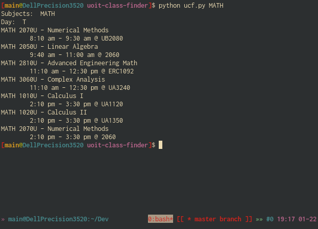
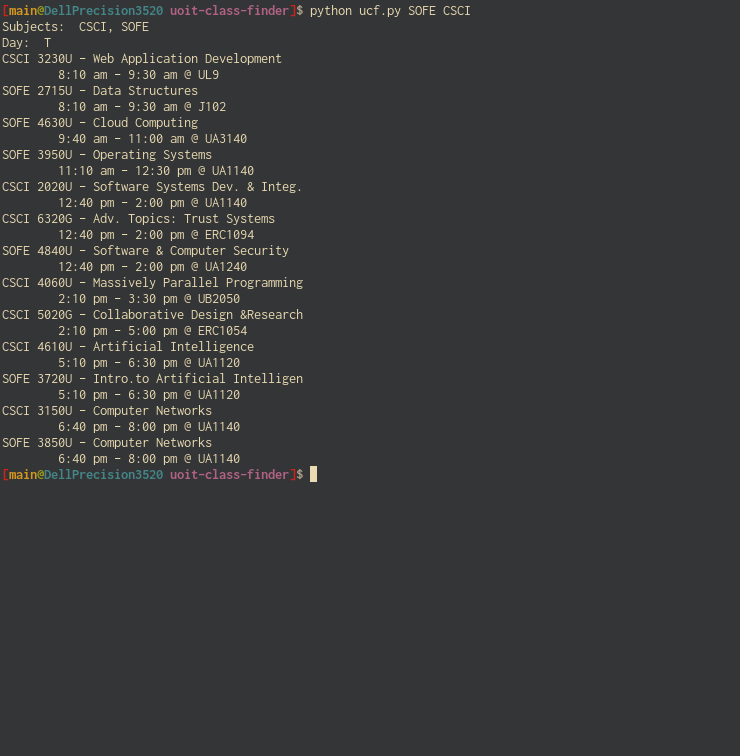
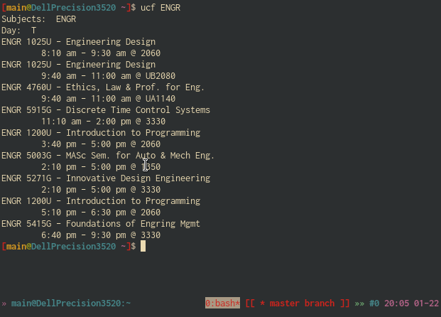

# uoit-class-finder
Finds UOIT / Ontario Tech University classes of the current day using the uoit class API and parsing the autogenerated HTML documents.

## Usage
`python ucf.py <subject code>`

subject codes: 

- ASLU - Academic Learning & Success 
- AEDT - Adult Education & Digital Tech 
- ANTH - Anthropology 
- APBS - Applied Bioscience 
- AUTE - Automotive Engineering 
- BIOL - Biology 
- BUSI - Business 
- CHEM - Chemistry 
- COMM - Communications 
- CSCI - Computer Science 
- CRMN - Criminology and Justice 
- ECON - Economics 
- EDUC - Education 
- ELEE - Electrical Engineering 
- ENGR - Engineering 
- ENGL - English 
- EAP - English for Academic Purposes 
- ENVS - Environmental Science 
- FSCI - Forensic Science 
- FREN - French 
- HLSC - Health Science 
- HIST - History 
- INDG - Indigenous Studies 
- INFR - Information Technology 
- LGLS - Legal Studies 
- MANE - Manufacturing Engineering 
- MITS - Masters of IT Security 
- MTSC - Materials Science 
- MATH - Mathematics 
- MECE - Mechanical Engineering 
- METE - Mechatronics 
- MLSC - Medical Lab Science 
- MCSC - Modelling & Computational Science 
- NUCL - Nuclear 
- NURS - Nursing 
- PHIL - Philosophy 
- POSC - Politcal Science 
- PSYC - Psychology 
- RADI - Radiation Science 
- SCCO - Science Co-op Work Term 
- SSCI - Social Science 
- SOCI - Sociology 
- SOFE - Software Engineering 
- SPAN - Spanish 
- STAT - Statstics 

## Examples

or 

I suggest setting up an alias for `python ucf.py` to make usage simpler as shown below:

